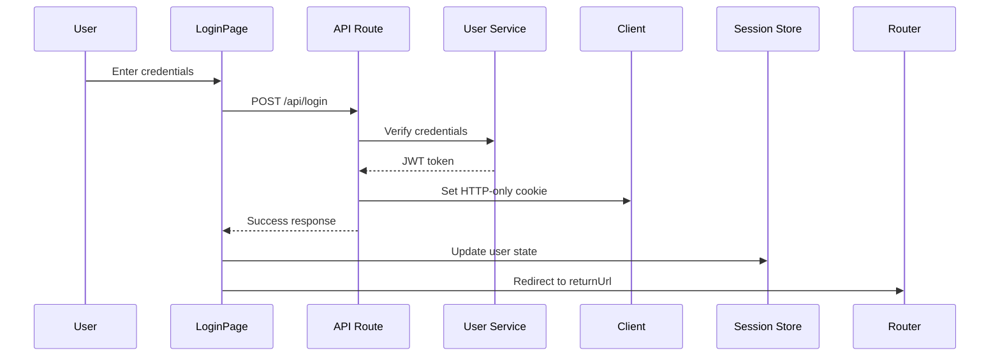

# Authentication & Authorization

## Overview

The frontend implements a comprehensive authentication and authorization system using session-based auth with JWT tokens stored in HTTP-only cookies. The system integrates with backend microservices for user management and permission checking.

## Architecture

```
Client → Auth Guards → Protected Pages
         ↓
         Session Store (Zustand)
         ↓
         Backend Services (User Service + Authz Service)
```

## Session Management

### Session Store

**Location**: `stores/use-session-store.ts`

Zustand store managing global session state:

```typescript
interface SessionStore {
  user: User | null;
  isAuthenticated: boolean;
  isLoading: boolean;
  setUser: (user: User | null) => void;
  setLoading: (loading: boolean) => void;
  clearSession: () => void;
}

export const useSessionStore = create<SessionStore>((set) => ({
  user: null,
  isAuthenticated: false,
  isLoading: true,

  setUser: (user) => set({
    user,
    isAuthenticated: !!user,
    isLoading: false,
  }),

  setLoading: (loading) => set({ isLoading: loading }),

  clearSession: () => set({
    user: null,
    isAuthenticated: false,
    isLoading: false,
  }),
}));
```

### Session Hydration

**Component**: `components/providers/client-session-hydrator.tsx`

Initializes session state from server:

```typescript
'use client'

export function ClientSessionHydrator({
  initialUser
}: {
  initialUser: User | null
}) {
  useHydrateSession(initialUser);
  return null;
}
```

**Hook**: `hooks/use-hydrate-session.ts`

```typescript
export function useHydrateSession(initialUser: User | null) {
  const setUser = useSessionStore((state) => state.setUser);

  useEffect(() => {
    setUser(initialUser);
  }, [initialUser, setUser]);
}
```

### Session Hook

**Location**: `hooks/use-session.ts`

Primary hook for accessing session state:

```typescript
export function useSession() {
  const { user, isAuthenticated, isLoading } = useSessionStore();

  return {
    user,
    isAuthenticated,
    isLoading,
  };
}
```

**Usage**:

```typescript
function ProfilePage() {
  const { user, isAuthenticated, isLoading } = useSession();

  if (isLoading) return <Spinner />;
  if (!isAuthenticated) return <Redirect to="/login" />;

  return <div>Welcome, {user.name}</div>;
}
```

## Authentication Guards

### Client-Side Guards

#### ClientUserGuard

**Location**: `components/auth/client-user-guard.tsx`

Protects user pages - redirects unauthenticated users to login.

```typescript
'use client'

export function ClientUserGuard({ children }: { children: ReactNode }) {
  const { isAuthenticated, isLoading } = useSession();
  const router = useRouter();
  const pathname = usePathname();

  useEffect(() => {
    if (!isLoading && !isAuthenticated) {
      // Save intended destination
      const returnUrl = encodeURIComponent(pathname);
      router.push(`/login?returnUrl=${returnUrl}`);
    }
  }, [isAuthenticated, isLoading, router, pathname]);

  if (isLoading) {
    return <LoadingSpinner />;
  }

  if (!isAuthenticated) {
    return null;
  }

  return <>{children}</>;
}
```

**Features**:

- Shows loading state during auth check
- Saves return URL for post-login redirect
- Prevents flash of protected content

**Usage**:

```typescript
// app/(user)/layout.tsx
export default function UserLayout({ children }) {
  return (
    <ClientUserGuard>
      {children}
    </ClientUserGuard>
  );
}
```

#### ClientAdminGuard

**Location**: `components/auth/client-admin-guard.tsx`

Protects admin pages - checks for admin role/permissions.

```typescript
'use client'

export function ClientAdminGuard({ children }: { children: ReactNode }) {
  const { user, isAuthenticated, isLoading } = useSession();
  const router = useRouter();

  useEffect(() => {
    if (!isLoading) {
      if (!isAuthenticated) {
        router.push('/login');
      } else if (!user?.isAdmin) {
        // Not admin - redirect to home
        router.push('/');
        toast.error('Access denied. Admin privileges required.');
      }
    }
  }, [isAuthenticated, isLoading, user, router]);

  if (isLoading) {
    return <AdminLoadingSkeleton />;
  }

  if (!isAuthenticated || !user?.isAdmin) {
    return null;
  }

  return <>{children}</>;
}
```

**Usage**:

```typescript
// app/(admin)/layout.tsx
export default function AdminLayout({ children }) {
  return (
    <ClientAdminGuard>
      {children}
    </ClientAdminGuard>
  );
}
```

### Server-Side Protection

API routes should also verify authentication:

```typescript
// app/api/protected/route.ts
import { cookies } from 'next/headers';
import { verifySession } from '@/lib/auth/session';

export async function GET(request: Request) {
  const cookieStore = cookies();
  const session = await verifySession(cookieStore);

  if (!session) {
    return NextResponse.json(
      { error: 'Unauthorized' },
      { status: 401 }
    );
  }

  // Proceed with authenticated request
  return NextResponse.json({ data: 'Protected data' });
}
```

## Authorization System

### Permission Checking

**Hook**: `hooks/use-permission.ts`

Check if user has specific permission:

```typescript
export function usePermission(permission: string): boolean {
  const { user } = useSession();

  return useMemo(() => {
    if (!user) return false;
    return user.permissions?.includes(permission) ?? false;
  }, [user, permission]);
}
```

**Usage**:

```typescript
function DeleteButton() {
  const canDelete = usePermission('reports.delete');

  if (!canDelete) return null;

  return <Button onClick={handleDelete}>Delete</Button>;
}
```

### Multiple Permissions

**Hook**: `hooks/use-permissions.ts`

Check multiple permissions at once:

```typescript
export function usePermissions(permissions: string[]): {
  hasAll: boolean;
  hasAny: boolean;
  permissions: Record<string, boolean>;
} {
  const { user } = useSession();

  return useMemo(() => {
    if (!user) {
      return {
        hasAll: false,
        hasAny: false,
        permissions: Object.fromEntries(
          permissions.map(p => [p, false])
        ),
      };
    }

    const permissionMap = Object.fromEntries(
      permissions.map(p => [
        p,
        user.permissions?.includes(p) ?? false
      ])
    );

    return {
      hasAll: Object.values(permissionMap).every(Boolean),
      hasAny: Object.values(permissionMap).some(Boolean),
      permissions: permissionMap,
    };
  }, [user, permissions]);
}
```

**Usage**:

```typescript
function AdminPanel() {
  const { hasAll, permissions } = usePermissions([
    'users.manage',
    'reports.moderate',
    'system.settings',
  ]);

  return (
    <div>
      {permissions['users.manage'] && <UserManagement />}
      {permissions['reports.moderate'] && <ReportModeration />}
      {permissions['system.settings'] && <SystemSettings />}
    </div>
  );
}
```

### Authz Service Integration

**Location**: `lib/api/authz.ts`

Functions to interact with authorization service:

```typescript
// Check if user has permission
export async function checkPermission(
  userId: string,
  permission: string
): Promise<boolean> {
  const response = await fetch('/api/authz/check', {
    method: 'POST',
    headers: { 'Content-Type': 'application/json' },
    body: JSON.stringify({ userId, permission }),
  });

  const data = await response.json();
  return data.hasPermission;
}

// Get all user permissions
export async function getUserPermissions(
  userId: string
): Promise<string[]> {
  const response = await fetch(`/api/authz/permissions?userId=${userId}`);
  const data = await response.json();
  return data.permissions;
}

// Check if user has role
export async function checkRole(
  userId: string,
  role: string
): Promise<boolean> {
  const response = await fetch('/api/authz/role', {
    method: 'POST',
    headers: { 'Content-Type': 'application/json' },
    body: JSON.stringify({ userId, role }),
  });

  const data = await response.json();
  return data.hasRole;
}
```

## Authentication Flow

### Login Flow



**Implementation**:

```typescript
// app/(auth)/login/page.tsx
'use client'

export default function LoginPage() {
  const router = useRouter();
  const searchParams = useSearchParams();
  const returnUrl = searchParams.get('returnUrl') || '/';
  const setUser = useSessionStore((state) => state.setUser);

  const handleSubmit = async (e: FormEvent) => {
    e.preventDefault();

    try {
      const response = await login(email, password);

      // Update session store
      setUser(response.user);

      // Redirect to return URL
      router.push(returnUrl);
      toast.success('Logged in successfully');
    } catch (error) {
      toast.error('Invalid credentials');
    }
  };

  return <form onSubmit={handleSubmit}>...</form>;
}
```

### Logout Flow

```typescript
// lib/api/auth.ts
export async function logout() {
  const response = await fetch('/api/logout', {
    method: 'POST',
  });

  if (response.ok) {
    // Clear client-side session
    useSessionStore.getState().clearSession();

    // Redirect to home
    window.location.href = '/';
  }
}
```

### Registration Flow

```typescript
// app/(auth)/register/page.tsx
const handleRegister = async (data: RegisterDto) => {
  try {
    await register(data);

    toast.success('Registration successful! Please log in.');
    router.push('/login');
  } catch (error) {
    if (error.message.includes('email already exists')) {
      toast.error('Email already registered');
    } else {
      toast.error('Registration failed');
    }
  }
};
```

### Password Reset Flow

**Step 1: Request Reset**

```typescript
// app/(auth)/forgot-password/page.tsx
const handleForgotPassword = async (email: string) => {
  try {
    await requestPasswordReset(email);
    toast.success('Reset link sent to your email');
  } catch (error) {
    toast.error('Failed to send reset link');
  }
};
```

**Step 2: Reset with Token**

```typescript
// app/(auth)/reset-password/page.tsx
const handleResetPassword = async (
  token: string,
  newPassword: string
) => {
  try {
    await resetPassword(token, newPassword);
    toast.success('Password reset successful');
    router.push('/login');
  } catch (error) {
    toast.error('Invalid or expired reset token');
  }
};
```

## Token Management

### HTTP-Only Cookies

Tokens are stored in HTTP-only cookies for security:

- Not accessible via JavaScript
- Automatically sent with requests
- Protected from XSS attacks

### Token Refresh

**Location**: `app/api/refresh/route.ts`

Automatically refreshes expired tokens:

```typescript
export async function POST() {
  const cookieStore = cookies();
  const refreshToken = cookieStore.get('refreshToken');

  if (!refreshToken) {
    return NextResponse.json(
      { error: 'No refresh token' },
      { status: 401 }
    );
  }

  // Call user service to refresh token
  const response = await fetch(`${USER_SERVICE_URL}/auth/refresh`, {
    method: 'POST',
    headers: {
      'Cookie': `refreshToken=${refreshToken.value}`,
    },
  });

  if (!response.ok) {
    return NextResponse.json(
      { error: 'Token refresh failed' },
      { status: 401 }
    );
  }

  // Set new access token cookie
  const data = await response.json();
  const res = NextResponse.json({ success: true });

  res.cookies.set('accessToken', data.accessToken, {
    httpOnly: true,
    secure: process.env.NODE_ENV === 'production',
    sameSite: 'lax',
    maxAge: 60 * 15, // 15 minutes
  });

  return res;
}
```

## Security Best Practices

### 1. CSRF Protection

Next.js provides automatic CSRF protection for API routes.

### 2. XSS Prevention

- HTTP-only cookies prevent JavaScript access
- Input sanitization on forms
- CSP headers in production

### 3. Secure Cookies

```typescript
res.cookies.set('token', value, {
  httpOnly: true,           // Not accessible via JavaScript
  secure: true,             // HTTPS only in production
  sameSite: 'lax',         // CSRF protection
  maxAge: 60 * 60 * 24,    // 24 hours
  path: '/',               // Available site-wide
});
```

### 4. Password Requirements

Enforced in registration form:

- Minimum 8 characters
- At least one uppercase letter
- At least one lowercase letter
- At least one number
- At least one special character

### 5. Rate Limiting

Implemented on backend but can add client-side delays:

```typescript
const handleLogin = async () => {
  setIsSubmitting(true);

  try {
    await login(email, password);
  } finally {
    // Prevent rapid submissions
    setTimeout(() => setIsSubmitting(false), 1000);
  }
};
```
