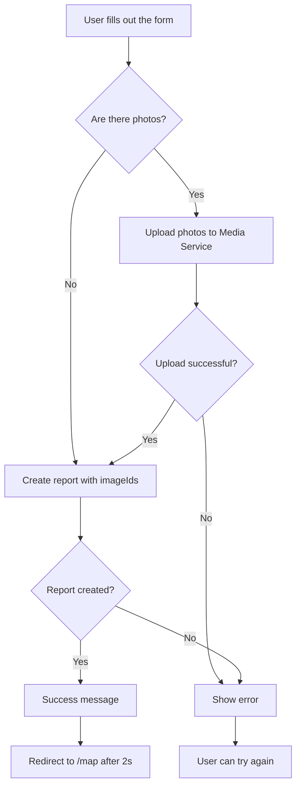

# Frontend Microservice

## Overview

The Frontend microservice is responsible for the user interface of the Risk Radar application. It is a Next.js application that communicates with the backend microservices via a gateway.

## Architecture

The frontend is a modern Next.js application. The main components of the architecture are:

- **Next.js:** A React framework for building server-side rendered and statically generated web applications.
- **React:** A JavaScript library for building user interfaces.
- **TypeScript:** A typed superset of JavaScript that compiles to plain JavaScript.
- **Tailwind CSS:** A utility-first CSS framework for rapidly building custom designs.
- **Shadcn/ui:** A collection of reusable UI components.
- **Zustand:** A small, fast and scalable bearbones state-management solution.

The application is structured as follows:

- `app/`: Contains the main application logic, including pages and layouts.
- `components/`: Contains reusable UI components.
- `hooks/`: Contains custom React hooks.
- `lib/`: Contains utility functions and libraries.
- `public/`: Contains static assets such as images and fonts.
- `stores/`: Contains Zustand state management stores.

## How to use

To run the frontend service locally, you need to have Node.js and npm installed.

1.  Install the dependencies:

    ```bash
    npm install
    ```

2.  Run the development server:

    ```bash
    npm run dev
    ```

The application will be available at `http://localhost:3000`.

## Assumptions

- The backend services are running and available at the gateway.
- The gateway is running and available at `http://localhost:8080`.
- The user has a modern web browser with JavaScript enabled.

### 2. Submitting New Incidents (`/submit-report`)

**Location**: `app/submit-report/page.tsx`

A full form for creating new reports with the following fields:

#### Form Fields

1.  **Title** (required)
    -   Text input
    -   Placeholder: "e.g., Damaged sidewalk"

2.  **Category** (required)
    -   Select dropdown
    -   All categories from the list above

3.  **Description** (optional)
    -   Textarea
    -   Multi-line description of the problem

4.  **Location** (required)
    -   Button: "Use my current location" (Geolocation API)
    -   OR manual entry:
        -   Latitude
        -   Longitude

5.  **Photos** (optional)
    -   File input (multiple)
    -   Accepts only images
    -   Preview of the number of selected files

#### Submission Process



#### API Integration

**Photo Upload**:
```typescript
POST /api/media/upload
Content-Type: multipart/form-data

Response: { imageIds: string[] }
```

**Create Report**:
```typescript
POST /api/reports/create
Content-Type: application/json

Body: {
  title: string
  description?: string
  latitude: number
  longitude: number
  reportCategory: ReportCategory
  imageIds?: string[]
  userId?: string | null
}

Response: {
  message: string
  status: "success" | "failure"
}
```

### 3. My Reports (`/my-reports`)

**Location**: `app/(user)/my-reports/page.tsx`, `app/(user)/my-reports/my-reports-client.tsx`

A page that allows the user to manage their own reports.

**Functionality**:
-   **List of reports**: A table displaying the user's reports with pagination.
-   **Filtering**:
    -   By status (Pending, Verified, Rejected).
    -   By report category.
-   **Sorting**: By creation date, update date, category, and status.
-   **Actions**:
    -   Deleting reports (with a confirmation modal).

### 4. Sidebar Navigation

Available on the map page, it contains links to:

-   **Report New Incident** (`/submit-report`) - orange highlight
-   **Your Activity** - user's report history
-   **Login** - authorization
-   **Admin Panel** - for users with admin privileges

### 5. API Routes (Proxy Layer)

The frontend acts as a proxy between the client and the backend services, providing:

-   Centralized URL configuration
-   Error handling
-   Request logging
-   Header forwarding (User-Agent, etc.)

#### Endpoints

**GET `/api/reports`**
-   Proxy to: `MAP_SERVICE_URL/reports`
-   Returns: A list of verified reports

**POST `/api/reports/create`**
-   Proxy to: `REPORT_SERVICE_URL/createReport`
-   Creates a new report

**POST `/api/media/upload`**
-   Proxy to: `MEDIA_SERVICE_URL/media/upload`
-   Uploads photos (multipart/form-data)

## Configuration

### Environment Variables

The frontend requires the following environment variables:

```bash
# Backend Service URLs
MAP_SERVICE_URL=http://localhost:8086
REPORT_SERVICE_URL=http://localhost:8081
MEDIA_SERVICE_URL=http://localhost:8084

# In a Docker environment - use the service names
# MAP_SERVICE_URL=http://map-service:8080
# REPORT_SERVICE_URL=http://report-service:8080
# MEDIA_SERVICE_URL=http://media-service:8080
```

### Docker Configuration

In `docker-compose.yml`:

```yaml
frontend:
    build:
        context: ./services/frontend
        dockerfile: Dockerfile
    container_name: frontend
    depends_on:
        - user-service
        - authz-service
        - report-service
        - map-service
        - media-service
    environment:
        MAP_SERVICE_URL: http://map-service:8080
        REPORT_SERVICE_URL: http://report-service:8080
        MEDIA_SERVICE_URL: http://media-service:8080
    networks:
        - backend
    ports:
        - "3000:3000"
    volumes:
        - ./services/frontend:/app
        - /app/node_modules
        - /app/.next
```

## Development

### Running Locally

```bash
cd services/frontend

# Install dependencies
npm install

# Development mode
npm run dev

# Production build
npm run build
npm start
```

### Requirements

-   Node.js 18+ or 20+
-   npm or pnpm
-   Running backend services (report-service, map-service, media-service)

### Hot Module Replacement

Next.js automatically handles HMR in development mode. Code changes are immediately visible in the browser.

## Styling

### Design System

The application uses a consistent design system with the following colors:

```css
--background: #2a221a      /* Dark brown */
--card: #362c20            /* Lighter brown */
--primary: #d97706         /* Orange */
--text: #e0dcd7            /* Light beige */
```

### UI Components

It uses the **shadcn/ui** library which provides:
-   Accessible components (a11y)
-   Customizable via Tailwind
-   TypeScript support
-   Radix UI primitives

### Responsive Design

-   Mobile-first approach
-   Breakpoints: sm, md, lg, xl, 2xl (Tailwind defaults)
-   Sidebar collapse on smaller screens
-   Touch-friendly controls on mobile devices

## Performance

### Optimizations

1.  **Server-Side Rendering (SSR)**
    -   Initial report data is fetched on the server
    -   Faster First Contentful Paint (FCP)

2.  **Dynamic Imports**
    -   Leaflet is loaded only on the client-side
    -   Reduces bundle size

3.  **Image Optimization**
    -   Next.js Image component (where possible)
    -   Lazy loading for images in popups

4.  **Marker Clustering**
    -   Grouping markers for better performance
    -   Better UX with a large number of reports

5.  **Debouncing**
    -   Search input (300ms delay)
    -   Reduces the number of API calls

### Cache Strategy

-   `cache: 'no-store'` for reports (always fresh data)
-   React Query cache for client-side requests
-   Static assets cached by CDN/browser

## Security

### CSRF Protection

Next.js automatically protects against CSRF in API routes.

### Input Validation

-   Client-side validation in forms
-   Server-side validation in API routes
-   TypeScript type checking

### Environment Variables

-   Sensitive data in `.env.local` (gitignored)
-   Different values for dev/production
-   Validation on application startup

## Testing

### Test Structure (TODO)

```bash
__tests__/
├── components/
│   ├── map-component.test.tsx
│   └── map-wrapper.test.tsx
├── pages/
│   ├── map.test.tsx
│   └── submit-report.test.tsx
└── api/
    ├── reports.test.ts
    └── media.test.ts
```

### Recommended Testing Libraries

-   Jest - Test runner
-   React Testing Library - Component testing
-   Playwright/Cypress - E2E testing

## Troubleshooting

### Common Problems

**1. The map does not load**
-   Check if Leaflet CSS is loaded
-   Verify `ssr: false` in the dynamic import
-   Check the browser console for errors

**2. No reports on the map**
-   Verify `MAP_SERVICE_URL`
-   Check the network tab in DevTools
-   Check the server-side logs in the terminal

**3. Photo upload does not work**
-   Verify `MEDIA_SERVICE_URL`
-   Check file size limits
-   Check the image format (only images are accepted)

**4. Geolocation does not work**
-   HTTPS is required (or localhost)
-   The user must grant permission
-   Fallback to manual coordinates

