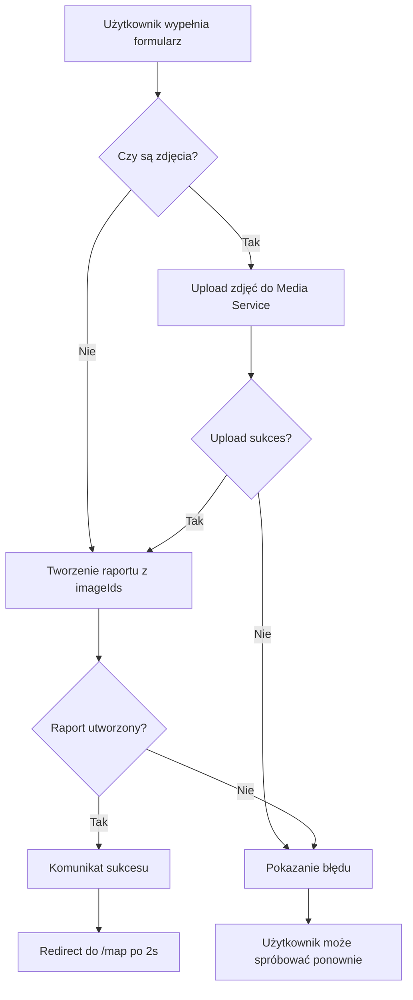

# Frontend Service

## Przegląd

Frontend Service to aplikacja webowa zbudowana w Next.js 14 (App Router), która stanowi główny interfejs użytkownika dla systemu RiskRadar. Aplikacja zapewnia interaktywny interfejs do przeglądania mapy zgłoszeń, tworzenia nowych raportów oraz zarządzania kontem użytkownika.

## Technologie

- **Framework**: Next.js 14 (App Router)
- **Language**: TypeScript
- **Styling**: Tailwind CSS
- **UI Components**: shadcn/ui
- **Mapa**: Leaflet.js z Marker Clustering
- **State Management**: React Query (TanStack Query)
- **Fonts**: Geist Sans, Geist Mono, Material Symbols

## Architektura

### Struktura katalogów

```
frontend/
├── app/                      # Next.js App Router
│   ├── (admin)/             # Strony administracyjne (chronione)
│   ├── (auth)/              # Strony autoryzacji (login, register)
│   ├── (public)/            # Strony publiczne
│   ├── (user)/              # Strony użytkownika (chronione)
│   │   └── my-reports/      # Lista zgłoszeń użytkownika
│   ├── api/                 # API Routes (proxy do backend services)
│   │   ├── media/
│   │   │   └── upload/     # Upload zdjęć do media-service
│   │   └── reports/
│   │       ├── route.ts    # Pobieranie raportów z map-service
│   │       └── create/     # Tworzenie nowego raportu
│   ├── map/                 # Strona mapy z wszystkimi zgłoszeniami
│   ├── submit-report/       # Formularz zgłaszania nowych zdarzeń
│   ├── layout.tsx           # Główny layout aplikacji
│   └── globals.css          # Globalne style
├── components/              # Komponenty React
│   ├── layout/             # Komponenty layoutu (header, footer)
│   ├── providers/          # Context providers
│   ├── ui/                 # UI komponenty (shadcn/ui)
│   ├── map-component.tsx   # Główny komponent mapy
│   └── map-wrapper.tsx     # Wrapper dla dynamicznego ładowania mapy
├── lib/                     # Biblioteki i utilities
│   ├── api/                # API client functions
│   ├── auth/               # Funkcje autoryzacji
│   └── utils.ts            # Utility functions
├── hooks/                   # Custom React hooks
├── stores/                  # Zustand stores (jeśli używane)
└── public/                  # Statyczne zasoby
    └── icons/              # Ikony dla kategorii zgłoszeń
```

## Główne funkcjonalności

### 1. Interaktywna mapa zgłoszeń (`/map`)

**Lokalizacja**: `app/map/page.tsx`, `components/map-component.tsx`

Mapa wyświetla wszystkie zweryfikowane zgłoszenia z różnych kategorii:

- **Marker Clustering**: Automatyczne grupowanie markerów dla lepszej wydajności
- **Kategorie ikony**: Każda kategoria ma dedykowaną ikonę
- **Popupy**: Szczegóły zgłoszenia z podglądem zdjęć
- **Lightbox**: Pełnowymiarowy podgląd zdjęć
- **Wyszukiwarka**: Wyszukiwanie miast w Polsce (Nominatim API)
- **Geolokalizacja**: Przycisk do zlokalizowania użytkownika
- **Kontrolki zoom**: Przybliżanie/oddalanie mapy

#### Kategorie zgłoszeń

| Kategoria | Nazwa polska | Ikona |
|-----------|--------------|-------|
| VANDALISM | Wandalizm | format_paint |
| INFRASTRUCTURE | Infrastruktura drogowa/chodników | construction |
| DANGEROUS_SITUATION | Niebezpieczne sytuacje | warning |
| TRAFFIC_ACCIDENT | Wypadki drogowe | car_crash |
| PARTICIPANT_BEHAVIOR | Zachowania kierowców/pieszych | person_alert |
| PARTICIPANT_HAZARD | Zagrożenia dla pieszych i rowerzystów | brightness_alert |
| WASTE_ILLEGAL_DUMPING | Śmieci/nielegalne zaśmiecanie | delete_sweep |
| BIOLOGICAL_HAZARD | Zagrożenia biologiczne | bug_report |
| OTHER | Inne | help_outline |

#### Komponenty mapy

```typescript
// Server Component - pobiera dane ze strony serwera
async function getInitialReports(): Promise<Report[]>

// Client Component - renderuje mapę z Leaflet
export default function MapComponent({ initialReports }: MapComponentProps)
```

**Kluczowe cechy**:
- SSR (Server-Side Rendering) dla początkowych danych
- Dynamic import dla Leaflet (client-side only)
- Responsive sidebar z menu nawigacyjnym
- Real-time search z debouncing

### 2. Zgłaszanie nowych zdarzeń (`/submit-report`)

**Lokalizacja**: `app/submit-report/page.tsx`

Pełny formularz do tworzenia nowych zgłoszeń z następującymi polami:

#### Pola formularza

1. **Tytuł** (wymagane)
   - Input tekstowy
   - Placeholder: "np. Uszkodzony chodnik"

2. **Kategoria** (wymagane)
   - Select dropdown
   - Wszystkie kategorie z listy powyżej

3. **Opis** (opcjonalne)
   - Textarea
   - Wieloliniowy opis problemu

4. **Lokalizacja** (wymagane)
   - Przycisk: "Użyj mojej obecnej lokalizacji" (Geolocation API)
   - LUB ręczne wprowadzenie:
     - Szerokość geograficzna (latitude)
     - Długość geograficzna (longitude)

5. **Zdjęcia** (opcjonalne)
   - Input file (multiple)
   - Akceptuje tylko obrazy
   - Podgląd liczby wybranych plików

#### Proces wysyłania



#### API Integration

**Upload zdjęć**:
```typescript
POST /api/media/upload
Content-Type: multipart/form-data

Response: { imageIds: string[] }
```

**Tworzenie raportu**:
```typescript
POST /api/reports/create
Content-Type: application/json

Body: {
  title: string
  description?: string
  latitude: number
  longitude: number
  reportCategory: ReportCategory
  imageIds?: string[]
  userId?: string | null
}

Response: {
  message: string
  status: "success" | "failure"
}
```

### 3. Moje zgłoszenia (`/my-reports`)

**Lokalizacja**: `app/(user)/my-reports/page.tsx`, `app/(user)/my-reports/my-reports-client.tsx`

Strona pozwalająca użytkownikowi zarządzać własnymi zgłoszeniami.

**Funkcjonalności**:
- **Lista zgłoszeń**: Tabela wyświetlająca zgłoszenia użytkownika z paginacją.
- **Filtrowanie**:
  - Po statusie (Oczekujące, Zweryfikowane, Odrzucone).
  - Po kategorii zgłoszenia.
- **Sortowanie**: Po dacie utworzenia, dacie aktualizacji, kategorii i statusie.
- **Akcje**:
  - Usuwanie zgłoszeń (z potwierdzeniem w modalu).

### 4. Sidebar Navigation

Dostępny na stronie mapy, zawiera linki do:

- **Zgłoś Nowe Zdarzenie** (`/submit-report`) - pomarańczowy highlight
- **Twoja Aktywność** - historia zgłoszeń użytkownika
- **Logowanie** - autoryzacja
- **Panel administratora** - dla użytkowników z uprawnieniami admin

### 5. API Routes (Proxy Layer)

Frontend działa jako proxy między klientem a backend services, zapewniając:

- Centralizację konfiguracji URL
- Obsługę błędów
- Logowanie requestów
- Przekazywanie headers (User-Agent, itp.)

#### Endpoints

**GET `/api/reports`**
- Proxy do: `MAP_SERVICE_URL/reports`
- Zwraca: Listę zweryfikowanych raportów

**POST `/api/reports/create`**
- Proxy do: `REPORT_SERVICE_URL/createReport`
- Tworzy nowy raport

**POST `/api/media/upload`**
- Proxy do: `MEDIA_SERVICE_URL/media/upload`
- Upload zdjęć (multipart/form-data)

## Konfiguracja

### Zmienne środowiskowe

Frontend wymaga następujących zmiennych środowiskowych:

```bash
# Backend Service URLs
MAP_SERVICE_URL=http://localhost:8086
REPORT_SERVICE_URL=http://localhost:8081
MEDIA_SERVICE_URL=http://localhost:8084

# W środowisku Docker - użyj nazw serwisów
# MAP_SERVICE_URL=http://map-service:8080
# REPORT_SERVICE_URL=http://report-service:8080
# MEDIA_SERVICE_URL=http://media-service:8080
```

### Docker Configuration

W `docker-compose.yml`:

```yaml
frontend:
    build:
        context: ./services/frontend
        dockerfile: Dockerfile
    container_name: frontend
    depends_on:
        - user-service
        - authz-service
        - report-service
        - map-service
        - media-service
    environment:
        MAP_SERVICE_URL: http://map-service:8080
        REPORT_SERVICE_URL: http://report-service:8080
        MEDIA_SERVICE_URL: http://media-service:8080
    networks:
        - backend
    ports:
        - "3000:3000"
    volumes:
        - ./services/frontend:/app
        - /app/node_modules
        - /app/.next
```

## Development

### Lokalne uruchamianie

```bash
cd services/frontend

# Instalacja zależności
npm install

# Development mode
npm run dev

# Production build
npm run build
npm start
```

### Wymagania

- Node.js 18+ lub 20+
- npm lub pnpm
- Uruchomione backend services (report-service, map-service, media-service)

### Hot Module Replacement

Next.js automatycznie obsługuje HMR w trybie development. Zmiany w kodzie są natychmiast widoczne w przeglądarce.

## Styling

### Design System

Aplikacja używa spójnego design system z następującymi kolorami:

```css
--background: #2a221a      /* Ciemny brąz */
--card: #362c20            /* Jaśniejszy brąz */
--primary: #d97706         /* Pomarańczowy */
--text: #e0dcd7            /* Jasny beż */
```

### Komponenty UI

Wykorzystuje bibliotekę **shadcn/ui** która zapewnia:
- Dostępne komponenty (a11y)
- Customizowalne przez Tailwind
- TypeScript support
- Radix UI primitives

### Responsive Design

- Mobile-first approach
- Breakpoints: sm, md, lg, xl, 2xl (Tailwind defaults)
- Sidebar collapse na mniejszych ekranach
- Touch-friendly controls na urządzeniach mobilnych

## Performance

### Optymalizacje

1. **Server-Side Rendering (SSR)**
   - Początkowe dane raportów pobierane na serwerze
   - Szybsze First Contentful Paint (FCP)

2. **Dynamic Imports**
   - Leaflet ładowane tylko po stronie klienta
   - Redukcja bundle size

3. **Image Optimization**
   - Next.js Image component (gdzie możliwe)
   - Lazy loading dla zdjęć w popupach

4. **Marker Clustering**
   - Grupowanie markerów dla lepszej wydajności
   - Lepsza UX przy dużej liczbie zgłoszeń

5. **Debouncing**
   - Search input (300ms delay)
   - Redukcja liczby API calls

### Cache Strategy

- `cache: 'no-store'` dla raportów (zawsze świeże dane)
- React Query cache dla client-side requestów
- Static assets cached przez CDN/browser

## Security

### CSRF Protection

Next.js automatycznie chroni przed CSRF w API routes.

### Input Validation

- Client-side validation w formularzach
- Server-side validation w API routes
- TypeScript type checking

### Environment Variables

- Wrażliwe dane w `.env.local` (gitignored)
- Różne wartości dla dev/production
- Walidacja przy starcie aplikacji

## Testing

### Struktura testów (TODO)

```bash
__tests__/
├── components/
│   ├── map-component.test.tsx
│   └── map-wrapper.test.tsx
├── pages/
│   ├── map.test.tsx
│   └── submit-report.test.tsx
└── api/
    ├── reports.test.ts
    └── media.test.ts
```

### Testing Libraries (Rekomendowane)

- Jest - Test runner
- React Testing Library - Component testing
- Playwright/Cypress - E2E testing

## Troubleshooting

### Częste problemy

**1. Mapa się nie ładuje**
- Sprawdź czy Leaflet CSS jest załadowany
- Verify `ssr: false` w dynamic import
- Check browser console for errors

**2. Brak zgłoszeń na mapie**
- Verify MAP_SERVICE_URL
- Check network tab w DevTools
- Sprawdź logi server-side w terminalu

**3. Upload zdjęć nie działa**
- Verify MEDIA_SERVICE_URL
- Check file size limits
- Sprawdź format obrazów (tylko images akceptowane)

**4. Geolokalizacja nie działa**
- HTTPS required (lub localhost)
- User must grant permission
- Fallback to manual coordinates

