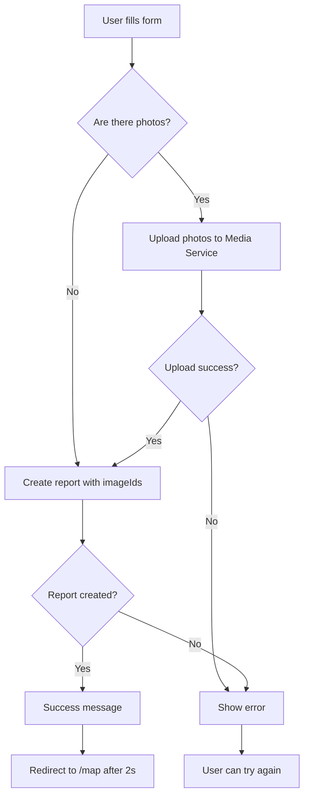

# Frontend Service

## Overview

The Frontend Service is a web application built with Next.js 14 (App Router) that serves as the main user interface for the RiskRadar system. It provides an interactive interface for viewing a map of incident reports, creating new reports, and managing user accounts.

## Tech Stack

- **Framework**: Next.js 14 (App Router)
- **Language**: TypeScript
- **Styling**: Tailwind CSS
- **UI Components**: shadcn/ui
- **Map**: Leaflet.js with Marker Clustering
- **State Management**: React Query (TanStack Query) + Zustand
- **Fonts**: Geist Sans, Geist Mono, Material Symbols

## Architecture

### Directory Structure

```
frontend/
├── app/                      # Next.js App Router
│   ├── (admin)/             # Admin pages (protected)
│   ├── (auth)/              # Auth pages (login, register)
│   ├── (public)/            # Public pages
│   ├── (user)/              # User pages (protected)
│   │   └── my-reports/      # User's report list
│   ├── api/                 # API Routes (proxy to backend services)
│   │   ├── media/
│   │   │   └── upload/     # Upload images to media-service
│   │   └── reports/
│   │       ├── route.ts    # Fetch reports from map-service
│   │       └── create/     # Create new report
│   ├── map/                 # Map page with all reports
│   ├── submit-report/       # New incident submission form
│   ├── layout.tsx           # Main application layout
│   └── globals.css          # Global styles
├── components/              # React components
│   ├── layout/             # Layout components (header, footer)
│   ├── providers/          # Context providers
│   ├── ui/                 # UI components (shadcn/ui)
│   ├── map-component.tsx   # Main map component
│   └── map-wrapper.tsx     # Wrapper for dynamic map loading
├── lib/                     # Libraries and utilities
│   ├── api/                # API client functions
│   ├── auth/               # Authorization functions
│   └── utils.ts            # Utility functions
├── hooks/                   # Custom React hooks
├── stores/                  # Zustand stores
└── public/                  # Static assets
    └── icons/              # Category icons
```

## Key Features

### 1. Interactive Report Map (`/map`)

**Location**: `app/map/page.tsx`, `components/map-component.tsx`

The map displays all verified reports from various categories:

- **Marker Clustering**: Automatic marker grouping for better performance
- **Category Icons**: Each category has a dedicated icon
- **Popups**: Report details with image preview
- **Lightbox**: Full-size image preview
- **Search**: City search in Poland (Nominatim API)
- **Geolocation**: Button to locate user
- **Zoom Controls**: Map zoom in/out

#### Report Categories

| Category | Polish Name | Icon |
|-----------|--------------|-------|
| VANDALISM | Wandalizm | format_paint |
| INFRASTRUCTURE | Infrastruktura drogowa/chodników | construction |
| DANGEROUS_SITUATION | Niebezpieczne sytuacje | warning |
| TRAFFIC_ACCIDENT | Wypadki drogowe | car_crash |
| PARTICIPANT_BEHAVIOR | Zachowania kierowców/pieszych | person_alert |
| PARTICIPANT_HAZARD | Zagrożenia dla pieszych i rowerzystów | brightness_alert |
| WASTE_ILLEGAL_DUMPING | Śmieci/nielegalne zaśmiecanie | delete_sweep |
| BIOLOGICAL_HAZARD | Zagrożenia biologiczne | bug_report |
| OTHER | Inne | help_outline |

#### Map Components

```typescript
// Server Component - fetches data from server side
async function getInitialReports(): Promise<Report[]>

// Client Component - renders map with Leaflet
export default function MapComponent({ initialReports }: MapComponentProps)
```

**Key Features**:

- SSR (Server-Side Rendering) for initial data
- Dynamic import for Leaflet (client-side only)
- Responsive sidebar with navigation menu
- Real-time search with debouncing

### 2. Report New Incidents (`/submit-report`)

**Location**: `app/submit-report/page.tsx`

Complete form for creating new reports with the following fields:

#### Form Fields

1. **Title** (required)
   - Text input
   - Placeholder: "e.g., Damaged sidewalk"

2. **Category** (required)
   - Select dropdown
   - All categories from the list above

3. **Description** (optional)
   - Textarea
   - Multi-line problem description

4. **Location** (required)
   - Button: "Use my current location" (Geolocation API)
   - OR manual entry:
     - Latitude
     - Longitude

5. **Photos** (optional)
   - File input (multiple)
   - Accepts images only
   - Preview of selected files count

#### Submission Process



#### API Integration

**Image Upload**:

```typescript
POST /api/media/upload
Content-Type: multipart/form-data

Response: { imageIds: string[] }
```

**Create Report**:

```typescript
POST /api/reports/create
Content-Type: application/json

Body: {
  title: string
  description?: string
  latitude: number
  longitude: number
  reportCategory: ReportCategory
  imageIds?: string[]
  userId?: string | null
}

Response: {
  message: string
  status: "success" | "failure"
}
```

### 3. My Reports (`/my-reports`)

**Location**: `app/(user)/my-reports/page.tsx`, `app/(user)/my-reports/my-reports-client.tsx`

Page allowing users to manage their own reports.

**Features**:

- **Report List**: Table displaying user's reports with pagination
- **Filtering**:
  - By status (Pending, Verified, Rejected)
  - By report category
- **Sorting**: By creation date, update date, category, and status
- **Actions**:
  - Delete reports (with modal confirmation)

### 4. Sidebar Navigation

Available on the map page, contains links to:

- **Report New Incident** (`/submit-report`) - orange highlight
- **Your Activity** - user's report history
- **Login** - authentication
- **Admin Panel** - for users with admin privileges

### 5. API Routes (Proxy Layer)

The frontend acts as a proxy between the client and backend services, providing:

- Centralized URL configuration
- Error handling
- Request logging
- Header forwarding (User-Agent, etc.)

#### Endpoints

**GET `/api/reports`**

- Proxies to: `MAP_SERVICE_URL/reports`
- Returns: List of verified reports

**POST `/api/reports/create`**

- Proxies to: `REPORT_SERVICE_URL/createReport`
- Creates new report

**POST `/api/media/upload`**

- Proxies to: `MEDIA_SERVICE_URL/media/upload`
- Upload images (multipart/form-data)

## Configuration

### Environment Variables

The frontend requires the following environment variables:

```bash
# Backend Service URLs
MAP_SERVICE_URL=http://localhost:8086
REPORT_SERVICE_URL=http://localhost:8081
MEDIA_SERVICE_URL=http://localhost:8084

# In Docker environment - use service names
# MAP_SERVICE_URL=http://map-service:8080
# REPORT_SERVICE_URL=http://report-service:8080
# MEDIA_SERVICE_URL=http://media-service:8080
```

### Docker Configuration

W `docker-compose.yml`:

```yaml
frontend:
    build:
        context: ./services/frontend
        dockerfile: Dockerfile
    container_name: frontend
    depends_on:
        - user-service
        - authz-service
        - report-service
        - map-service
        - media-service
    environment:
        MAP_SERVICE_URL: http://map-service:8080
        REPORT_SERVICE_URL: http://report-service:8080
        MEDIA_SERVICE_URL: http://media-service:8080
    networks:
        - backend
    ports:
        - "3000:3000"
    volumes:
        - ./services/frontend:/app
        - /app/node_modules
        - /app/.next
```

## Development

### Local Setup

```bash
cd services/frontend

# Install dependencies
npm install

# Development mode
npm run dev

# Production build
npm run build
npm start
```

### Requirements

- Node.js 18+ or 20+
- npm or pnpm
- Running backend services (report-service, map-service, media-service)

### Hot Module Replacement

Next.js automatically handles HMR in development mode. Code changes are immediately visible in the browser.

## Styling

### Design System

The application uses a consistent design system with the following colors:

```css
--background: #2a221a      /* Dark brown */
--card: #362c20            /* Lighter brown */
--primary: #d97706         /* Orange */
--text: #e0dcd7            /* Light beige */
```

### UI Components

Uses the **shadcn/ui** library which provides:

- Accessible components (a11y)
- Customizable through Tailwind
- TypeScript support
- Radix UI primitives

### Responsive Design

- Mobile-first approach
- Breakpoints: sm, md, lg, xl, 2xl (Tailwind defaults)
- Sidebar collapse on smaller screens
- Touch-friendly controls on mobile devices

## Performance

### Optimizations

1. **Server-Side Rendering (SSR)**
   - Initial report data fetched on server
   - Faster First Contentful Paint (FCP)

2. **Dynamic Imports**
   - Leaflet loaded only on client side
   - Bundle size reduction

3. **Image Optimization**
   - Next.js Image component (where possible)
   - Lazy loading for popup images

4. **Marker Clustering**
   - Marker grouping for better performance
   - Better UX with large number of reports

5. **Debouncing**
   - Search input (300ms delay)
   - API call reduction

### Cache Strategy

- `cache: 'no-store'` for reports (always fresh data)
- React Query cache for client-side requests
- Static assets cached by CDN/browser

## Security

### CSRF Protection

Next.js automatycznie chroni przed CSRF w API routes.

### Input Validation

- Client-side validation in forms
- Server-side validation in API routes
- TypeScript type checking

### Environment Variables

- Sensitive data in `.env.local` (gitignored)
- Different values for dev/production
- Validation on application startup

## Testing

### Test Structure (TODO)

```bash
__tests__/
├── components/
│   ├── map-component.test.tsx
│   └── map-wrapper.test.tsx
├── pages/
│   ├── map.test.tsx
│   └── submit-report.test.tsx
└── api/
    ├── reports.test.ts
    └── media.test.ts
```

### Testing Libraries (Recommended)

- Jest - Test runner
- React Testing Library - Component testing
- Playwright/Cypress - E2E testing
