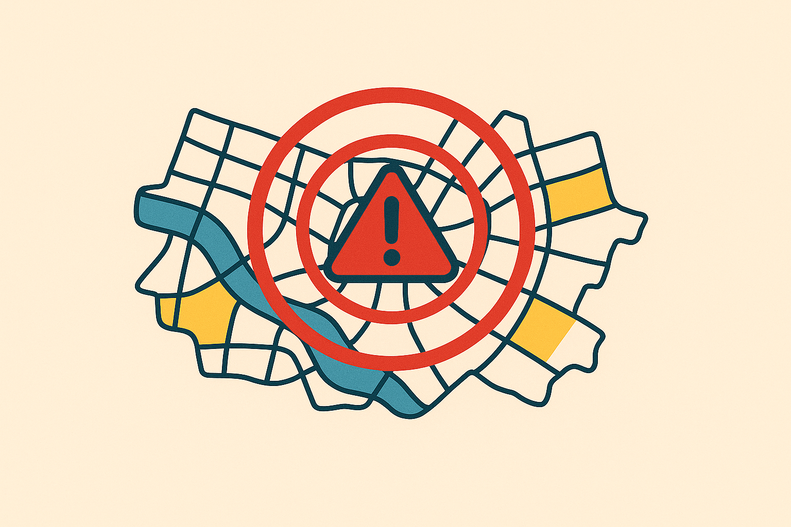

# Home | Risk Radar Documentation

  

Welcome to the RiskRadar microservices documentation.  
This document provides an overview of the microservices, their owners, key features, and the project roadmap.

---

## Microservices and Owners

| Service Name                           | Owner             |
|--------------------------------------|-------------------|
| User Service                         | @Filip Sanecki    |
| Authz Service                        | @Sergiusz Sanetra |
| Notification Service                 | @Sergiusz Sanetra |
| Report Service                      | @Filip Sanecki    |
| Map Service                        | @Filip Sanecki    |
| AI Categorization Service           | @Michał Rzepecki  |
| AI Verification & Duplication Service | @Michał Rzepecki  |
| AI Assistant Service                | @Michał Rzepecki  |
| Statistics Service                  | @Sergiusz Sanetra |
| Community Service                  | @Sergiusz Sanetra |
| Media Service                     | @Sergiusz Sanetra |
| API Gateway                      | @Sergiusz Sanetra |
| Admin Service                    | @Filip Sanecki    |
| Monitoring Service               | @Michał Rzepecki  |
| Audit Log Service                | @Sergiusz Sanetra |

---

## Key Features and Notes from Initial Meeting

- User account registration and management.
- AI-powered report verification and validation.
- Chat-like report creation with AI assistant.
- Threat level estimation for reports.
- AI validation with follow-up questions if info is incomplete.
- Centralized Notification microservice for all communications.
- AI categorization with manual override option.
- AI grouping of similar nearby reports.
- Interactive homepage with map, legend, filters, and login menu.
- Detailed report viewing on map.
- Report types include:
  - Vandalism
  - Road and sidewalk infrastructure issues
  - Dangerous situations
  - Traffic accidents
  - Driver/pedestrian behavior
  - Threats to pedestrians, cyclists, drivers
  - Illegal dumping and waste
  - Biological threats
  - Other

- Category guides during report creation.
- Report cancellation by volunteers or community.
- Notifications sent to residents in the affected area.
- AI Virtual Assistant on map view with report summaries.
- Mobile app planned post-web readiness.
- Statistics dashboard: daily reports, user counts, etc.
- Role system: admin, moderator, user.
- Admin rights include assigning moderators.
- Moderators can edit/delete reports.
- Lists for recent reports and users with filtering & pagination.
- Extensive statistics: cities, categories, users, server health, AI health.
- User banning/unbanning features.
- Personal report history.